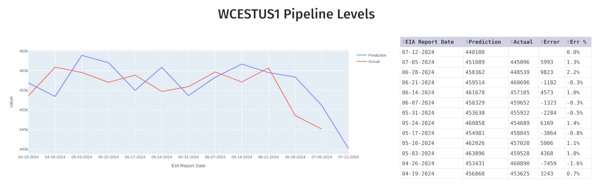

# Pipeline Level Prediction

Using [EAI](http://ir.eia.gov) data that contains weekly pipeline oil flows and other data sources.  The EIA report is scheduled for availability, weekly Wednesday and sometimes Thursday's at 10:30 a.m., Eastern US time. Pricing data is now retreived from yfinance as EIA no longer provides updated data on prices. Eventually pulling of the weekly file will be via corresponding API requests.

**Goal** of this project is to predict future oil flow levels.
This is an attempt to predict the WCESTUS1 reserves level one or more weeks in advance using varying ML modeling techniques.

The structure of this app will have a mix of some notebooks and python files to retrieve data, try variations of models, and visualize. It also will have an API endpoint to retrieve the data. Example here:
[...
  {
    "report_date": 1718323200000,
    "actual_supply": 457105,
    "prediction": 461678,
    "value_err": 4573,
    "err_rate": 0.01,
    "name": "WCESTUS1",
    "report_date_formatted": "06-14-2024"
  },
  {
    "report_date": 1718928000000,
    "actual_supply": 460696,
    "prediction": 459514,
    "value_err": -1182,
    "err_rate": -0.003,
    "name": "WCESTUS1",
    "report_date_formatted": "06-21-2024"
  },
  {
    "report_date": 1719532800000,
    "actual_supply": null,
    "prediction": 458362,
    "value_err": null,
    "err_rate": 0,
    "name": "WCESTUS1",
    "report_date_formatted": "06-28-2024"
  }
]

### Visualization
WIP, but to make this more palletable, a graphical interface should be implemented. Example image of plotly graph/data:

### Notebooks / research
Predictions are hard and having a workspace such as jupyter notebooks should also be a target.

### DOCKER container
The top level Dockerfile does work. It uses a basic cronjob to run eia download and prediction python scripts every hour and two hours respecitively. There's an argument to not run this in a container w/the size of neuralprophet, but it will work in container.

### Data Storage
Most data is downloaded (eia and yfinance) to build .csv files. However, storing data persistently for past predictions is setup for a mysql db. For storage in mysql add in -- don't commit! -- a .env file with the following vars:
DB_HOST=<host by ip or name>
DB_DATABASE=<database name>
DB_USER=<database user>
DB_PASSWORD=<database pass>

### Basic build and run commands for quick-ref:
Build container - docker build -t pipeline_pred .
Run container in background - docker run -d --restart unless-stopped --name pipe_predictor pipeline_pred:latest

WIP to say the least :)
