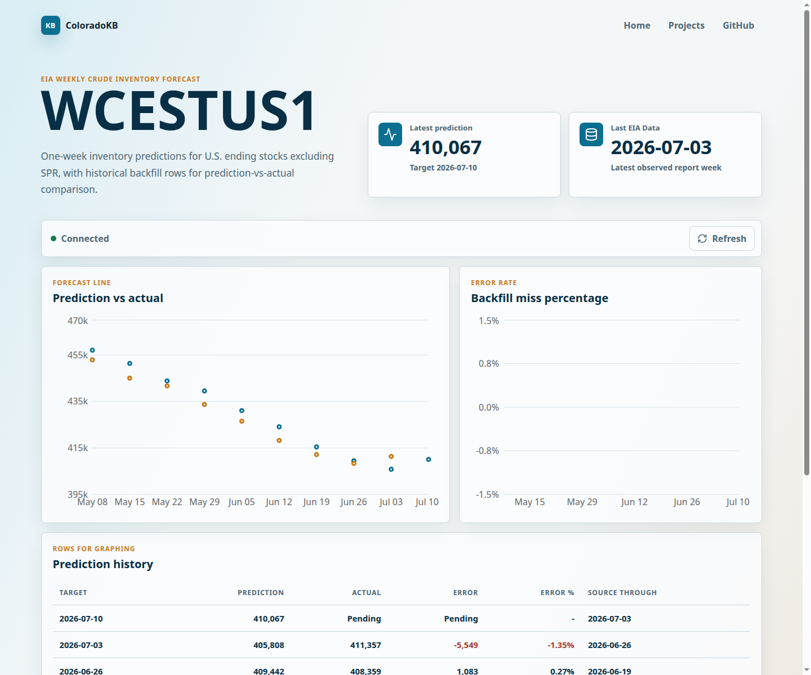

# Pipeline Level Prediction

Using [EIA](https://www.eia.gov/opendata/) data that contains weekly crude oil inventory levels and related market data. The EIA report is scheduled for availability weekly, usually Wednesday and sometimes Thursday at 10:30 a.m. Eastern US time.

**Goal** of this project is to predict future oil flow levels.
This is an attempt to predict the WCESTUS1 reserves level one or more weeks in advance using varying ML modeling techniques.

The current runtime ingests EIA API data, trains a one-week `WCESTUS1` prediction model, stores observations and predictions in MySQL or SQLite, and exposes API endpoints for a future web interface. Example prediction shape:
```
[...
  {
    "report_date": 1718323200000,
    "actual_supply": 457105,
    "prediction": 461678,
    "value_err": 4573,
    "err_rate": 0.01,
    "name": "WCESTUS1",
    "report_date_formatted": "06-14-2024"
  },
  {
    "report_date": 1718928000000,
    "actual_supply": 460696,
    "prediction": 459514,
    "value_err": -1182,
    "err_rate": -0.003,
    "name": "WCESTUS1",
    "report_date_formatted": "06-21-2024"
  },
  {
    "report_date": 1719532800000,
    "actual_supply": null,
    "prediction": 458362,
    "value_err": null,
    "err_rate": 0,
    "name": "WCESTUS1",
    "report_date_formatted": "06-28-2024"
  }
]
```
### Visualization
The React dashboard shows the latest one-week forecast, last observed EIA data
period, prediction-vs-actual history, backfill error rate, and graphing rows
served by the FastAPI endpoints.



### DOCKER container
The top-level Dockerfile runs a cron job for EIA ingest and prediction through
`pipeline_pred.cli`. The weekly scheduler runs after the EIA release window at
10:45 a.m. Eastern on Wednesday and Thursday. Wednesday covers the normal EIA
Weekly Petroleum Status Report release, and Thursday catches the typical one-day
delay when a federal holiday falls on Monday or Tuesday.

### Data Storage
The implementation lives under `src/pipeline_pred` and focuses on one
production path first: weekly `WCESTUS1` observations from the EIA API, daily WTI
spot prices from the EIA API, a Ridge-regression one-week forecast, MySQL or
SQLite storage, and FastAPI endpoints.

Environment:

```bash
cp .env.example .env
# Add EIA_API_KEY if you have one. EIA may allow limited demo-key style access,
# but a real key should be used for scheduled runs.
```

Database selection:

- If `DATABASE_URL` is set, it is used directly.
- If `DATABASE_URL` is not set and `MYSQL_HOST`, `MYSQL_DB`, and `MYSQL_USER`
  are present, the app uses MySQL.
- If neither is configured, the app falls back to
  `sqlite:///data/pipeline_predictions.sqlite3`.

Expected MySQL variables:

```bash
API_HOST_PORT=8560
MYSQL_HOST=
MYSQL_PORT=3306
MYSQL_DB=
MYSQL_USER=
MYSQL_PASSWORD=
```

Run locally:

```bash
python -m venv .venv
source .venv/bin/activate
pip install -r requirements.txt
PYTHONPATH=src python -m pipeline_pred.cli init-db
PYTHONPATH=src python -m pipeline_pred.cli run-pipeline --start 2015-01-01
PYTHONPATH=src python -m pipeline_pred.cli backfill-history --series WCESTUS1 --weeks 9
PYTHONPATH=src uvicorn pipeline_pred.api.main:app --host 0.0.0.0 --port 8000
```

API endpoints:

- `GET /health`
- `GET /observations?series=WCESTUS1`
- `GET /predictions?series=WCESTUS1`
- `GET /predictions/latest?series=WCESTUS1`

### Basic build and run commands

```bash
docker build -t pipeline_pred .
docker run -d --restart unless-stopped --env-file .env -p 8000:8000 --name pipe_predictor_api pipeline_pred:latest
docker run --rm --env-file .env pipeline_pred:latest init-db
docker run --rm --env-file .env pipeline_pred:latest run-pipeline --start 2024-01-01
docker run -d --restart unless-stopped --env-file .env --name pipe_predictor_scheduler pipeline_pred:latest scheduler
```

Docker Compose:

```bash
docker compose up -d api
docker compose up -d --build frontend
docker compose --profile scheduler up -d
docker compose run --rm api init-db
docker compose run --rm api run-pipeline --start 2024-01-01
```

The API is published on `API_HOST_PORT`, defaulting to `8560`.
The frontend is published on `FRONTEND_HOST_PORT`, defaulting to `8561`.
The frontend proxies `/api/*` to the backend service, so it works through
`localhost`, LAN hostnames, and reverse proxies without rebuilding the UI.
